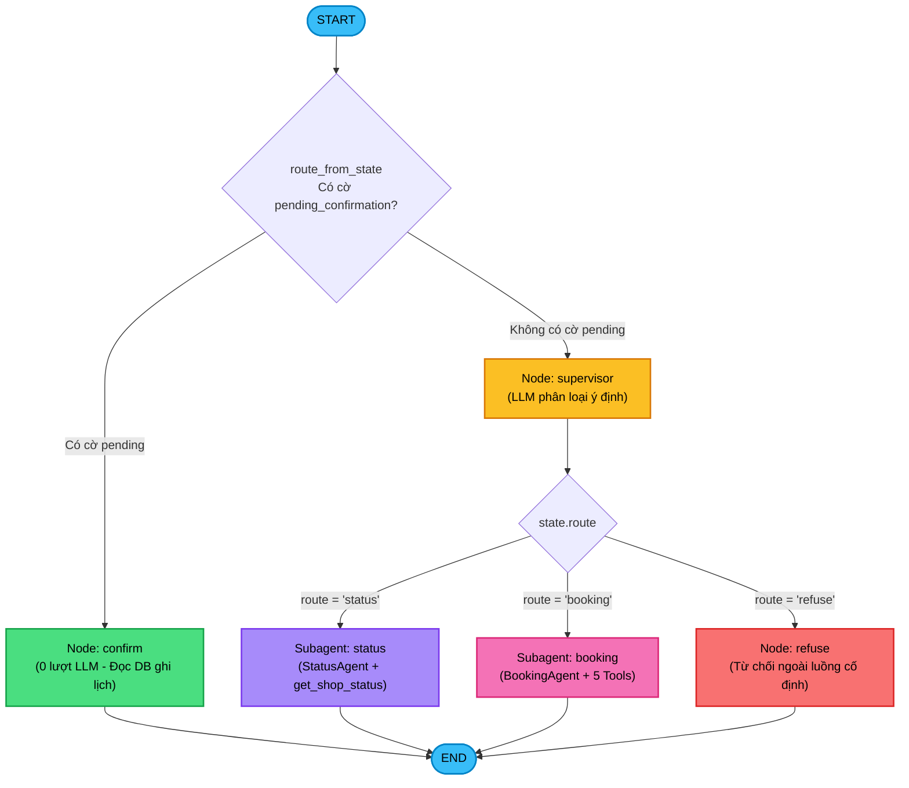
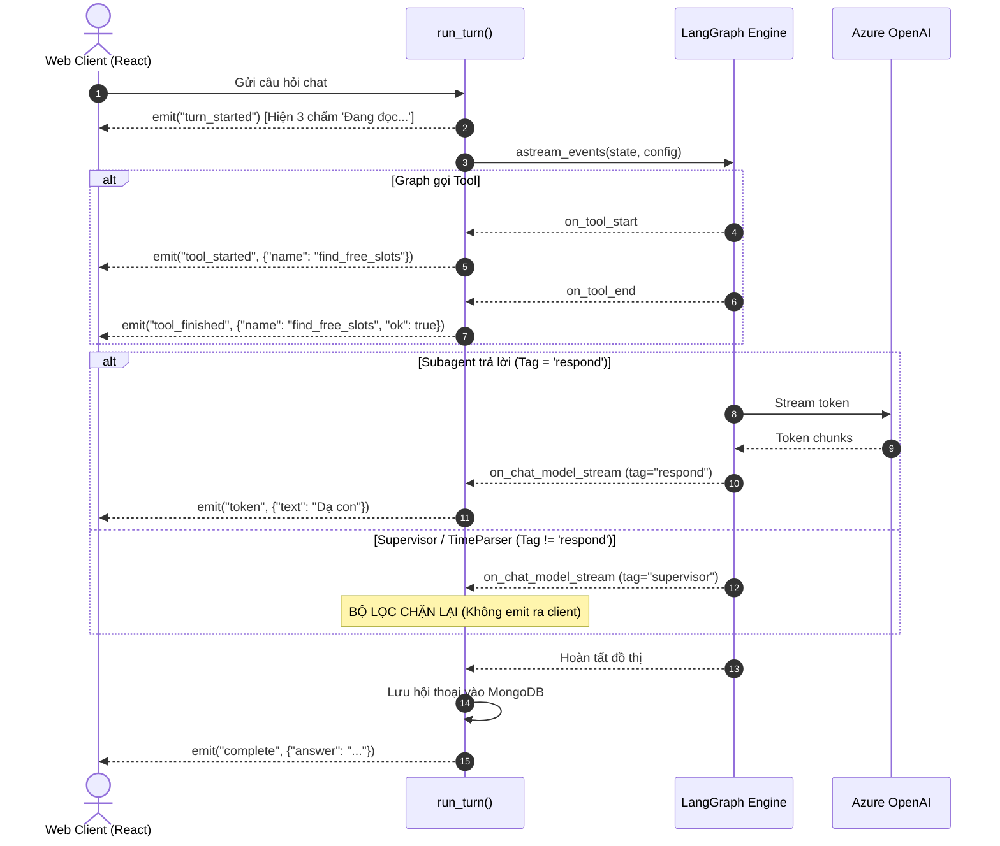

# KIẾN TRÚC AGENT GRAPH & TRACE MÃ NGUỒN — SALONA BOOKING

> **Hệ thống:** Trợ lý AI Đặt lịch Nail & Tóc cho người lớn tuổi (FastAPI + LangGraph + MongoDB + Socket.IO)  
> **Thư mục mã nguồn:** [`app/agents/booking_graph/`](file:///home/henryb1/Desktop/HenryB1/data/salona-booking/app/agents/booking_graph/)  
> **Mục đích tài liệu:** Mô tả toàn diện đồ thị LangGraph, các Subagent, các Node chức năng, cơ chế định tuyến, bộ công cụ (Tools), vòng đời xử lý sự kiện realtime và các ràng buộc an toàn bất biến.

---

## MỤC LỤC

1. [Sơ đồ Kiến trúc Tổng thể (Agent Graph Workflow)](#1-sơ-đồ-kiến-trúc-tổng-thể-agent-graph-workflow)
2. [Cấu trúc State (`GraphState`)](#2-cấu-trúc-state-graphstate)
3. [Chi tiết các Node và Subagent](#3-chi-tiết-các-node-và-subagent)
   - 3.1 Supervisor Node (Router phân loại ý định)
   - 3.2 Booking Subagent (Subagent Đặt lịch)
   - 3.3 Status Subagent (Subagent Trạng thái tiệm)
   - 3.4 Confirm Node (Xác nhận đặt lịch tất định 0-LLM)
   - 3.5 Refuse Node (Từ chối ngoài luồng)
4. [Bộ Công cụ (Tools Scoping & Definitions)](#4-bộ-công-cụ-tools-scoping--definitions)
5. [Cơ chế Điều hướng (Conditional Routing)](#5-cơ-chế-điều-hướng-conditional-routing)
6. [Bố cục Prompt & Tối ưu hóa Cache (Prompt Caching)](#6-bố-cục-prompt--tối-ưu-hóa-cache-prompt-caching)
7. [Vòng đời Xử lý Sự kiện & Streaming Realtime](#7-vòng-đời-xử-lý-sự-kiện--streaming-realtime)
8. [Các Ràng buộc Kỹ thuật & Bẫy Thiết kế Đã Khắc Phục](#8-các-ràng-buộc-kỹ-thuật--bẫy-thiết-kế-đã-khắc-phục)

---

## 1. SƠ ĐỒ KIẾN TRÚC TỔNG THỂ (AGENT GRAPH WORKFLOW)

Đồ thị được xây dựng trên nền tảng **LangGraph StateGraph** ([`app/agents/booking_graph/graph.py`](file:///home/henryb1/Desktop/HenryB1/data/salona-booking/app/agents/booking_graph/graph.py)). 

Mỗi lượt trò chuyện được khởi tạo thông qua hàm `build_graph(db, user)`. Điểm đặc biệt: Đối tượng `user` được **đóng kín trong closure** của các tool khi khởi tạo, đảm bảo `user_id` không bao giờ xuất hiện như một tham số LLM có thể bị lợi dụng để thao tác dữ liệu người khác.



---

## 2. CẤU TRÚC STATE (`GraphState`)

Mã nguồn tại [`app/agents/booking_graph/state.py`](file:///home/henryb1/Desktop/HenryB1/data/salona-booking/app/agents/booking_graph/state.py):

```python
from typing import Annotated, Any, Dict, List, Optional, TypedDict
from langchain_core.messages import AnyMessage
from langgraph.graph.message import add_messages

class GraphState(TypedDict, total=False):
    """State của một lượt chat. Mọi node đọc và ghi qua đây — không có biến toàn cục."""
    
    messages: Annotated[List[AnyMessage], add_messages]  # Lịch sử và chuỗi message hội thoại
    user_id: str                                         # ID của khách hàng trích xuất từ JWT
    context_block: str                                   # Khối bối cảnh định danh & thời gian hiện tại
    pending_confirmation: Optional[Dict[str, Any]]      # Cờ giữ chỗ tạm thời (start_at, note, xung_ho)
    route: str                                          # Nhánh định tuyến ('booking' | 'status' | 'refuse')
    answer: str                                         # Câu trả lời cuối cùng gửi cho khách
```

---

## 3. CHI TIẾT CÁC NODE VÀ SUBAGENT

### 3.1 Supervisor Node (Router phân loại ý định)
* **Mã nguồn:** [`app/agents/booking_graph/supervisor.py`](file:///home/henryb1/Desktop/HenryB1/data/salona-booking/app/agents/booking_graph/supervisor.py)
* **Nhiệm vụ:** Phân tích 4 lượt chat gần nhất (`SUPERVISOR_HISTORY_TURNS = 4`) để phân loại ý định vào 1 trong 3 nhánh: `booking`, `status`, `refuse`.
* **Cấu hình Model:** `tags=["supervisor"]`, `temperature=0.0`.
* **Tối ưu Token:** Không nhận memory, không nhận schema tool, không nhận lịch hẹn $\rightarrow$ Giảm kích thước prompt từ ~500 xuống ~200 token.
* **Lọc Stream:** Token JSON đầu ra của supervisor bị chặn lại ở tầng phát sự kiện, không stream ra giao diện khách hàng.
* **Quy tắc Fallback:** Nếu model trả về từ khóa lạ ngoài `{"booking", "status", "refuse"}`, hệ thống mặc định fallback về `"booking"`.

```python
SUPERVISOR_PROMPT = """Bạn phân loại ý định của khách tại một tiệm làm nail và tóc.

Trả lời DUY NHẤT một từ, không giải thích:
- booking : khách muốn đặt lịch, đổi lịch, hủy lịch, hỏi giờ trống, hoặc xem lịch của mình
- status  : khách hỏi chủ tiệm đang bận hay rảnh, hoặc khi nào xong
- refuse  : mọi thứ khác — chuyện phiếm, quảng cáo, hỏi kiến thức, nhờ làm việc khác

Khi phân vân giữa booking và refuse, chọn booking."""
```

---

### 3.2 Booking Subagent (Subagent Đặt Lịch — Node `"booking"`)
* **Mã nguồn:** [`app/agents/booking_graph/agents.py`](file:///home/henryb1/Desktop/HenryB1/data/salona-booking/app/agents/booking_graph/agents.py) kết hợp `BOOKING_PROMPT` và `make_booking_tools(db, user)`.
* **Nhiệm vụ:** Hỗ trợ đặt lịch, tra cứu slot trống, xem danh sách lịch cá nhân, huỷ lịch.
* **Cấu hình Model:** `tags=["respond"]`, `temperature=0.2`.
* **Vòng lặp Tool:** Cho phép gọi tối đa `MAX_TOOL_ROUNDS = 4` vòng lặp tool trước khi trả lời.
* **Quy tắc cốt lõi:**
  1. Bắt buộc gọi `parse_time` trước khi tìm slot hoặc giữ chỗ.
  2. Phải nhắc lại ngày giờ bằng lời cho khách nghe trước khi ghi lịch.
  3. Luôn gọi `list_my_appointments` trước khi huỷ lịch.
  4. Nếu giờ khách muốn đã có người, tự động gọi `find_free_slots` và gợi ý 2-3 giờ trống gần nhất.
  5. Tuyệt đối **không có tool `create_appointment`**; chỉ được dùng `propose_appointment`.

---

### 3.3 Status Subagent (Subagent Trạng Thái Tiệm — Node `"status"`)
* **Mã nguồn:** [`app/agents/booking_graph/agents.py`](file:///home/henryb1/Desktop/HenryB1/data/salona-booking/app/agents/booking_graph/agents.py) kết hợp `STATUS_PROMPT` và `make_status_tools(db, user)`.
* **Nhiệm vụ:** Kiểm tra chủ tiệm đang bận hay rảnh, và nếu bận thì mấy giờ xong.
* **Cấu hình Model:** `tags=["respond"]`, `temperature=0.2`.
* **Tool duy nhất:** `get_shop_status()`.
* **Quy tắc phát ngôn:** Diễn đạt bằng **mốc giờ tuyệt đối** (ví dụ: *"xong lúc 3:30 chiều"*), không bao giờ nói *"còn 30 phút"* (vì câu nói sẽ lưu vào lịch sử và bị sai khi đọc lại sau đó).

---

### 3.4 Confirm Node (Xác Nhận Đặt Lịch Tất Định — Node `"confirm"`)
* **Mã nguồn:** [`app/agents/booking_graph/confirm.py`](file:///home/henryb1/Desktop/HenryB1/data/salona-booking/app/agents/booking_graph/confirm.py)
* **Nhiệm vụ:** Nhánh tắt thực thi khi khách xác nhận đồng ý ("ừ", "đúng rồi", "ok").
* **Chi phí:** **0 lượt LLM**, tốc độ phản hồi tính bằng mili-giây.
* **Cơ chế hoạt động:**
  1. Sử dụng Regex tiếng Việt có dấu (`_YES`, `_NO`) và không dấu (`_YES_BARE`, `_NO_BARE`) để nhận diện ý định. Phủ định luôn thắng khẳng định (ví dụ: *"dạ không"* $\rightarrow$ `False`).
  2. Đọc trực tiếp `start_at`, `note`, `xung_ho` từ `state["pending_confirmation"]` (dữ liệu từ MongoDB).
  3. Gọi [`AppointmentService.create()`](file:///home/henryb1/Desktop/HenryB1/data/salona-booking/app/services/appointment.py) để ghi lịch hẹn vào Database.
  4. Xoá cờ `pending_confirmation` khỏi MongoDB.
  5. Trả về câu thông báo thành công có định dạng ngày giờ tiếng Việt hoàn chỉnh.

---

### 3.5 Refuse Node (Từ Chối Ngoài Luồng — Node `"refuse"`)
* **Mã nguồn:** [`app/agents/booking_graph/supervisor.py`](file:///home/henryb1/Desktop/HenryB1/data/salona-booking/app/agents/booking_graph/supervisor.py#L41-L45)
* **Nhiệm vụ:** Chặn các câu hỏi không liên quan đến tiệm nail-tóc (thời tiết, bảo hiểm, số đề, prompt injection...).
* **Chi phí:** **0 lượt LLM** (trả về hằng số chuỗi cố định):
  > *"Dạ con chỉ giúp được việc đặt lịch làm tóc và làm nail thôi ạ. Cô chú cần đặt lịch ngày nào để con xem giúp ạ?"*

---

## 4. BỘ CÔNG CỤ (TOOLS SCOPING & DEFINITIONS)

Mã nguồn tại [`app/agents/booking_graph/tools.py`](file:///home/henryb1/Desktop/HenryB1/data/salona-booking/app/agents/booking_graph/tools.py):

| Tên Tool | Subagent sử dụng | Tham số đầu vào | Mô tả chức năng & Hành vi kỹ thuật |
|---|---|---|---|
| `get_shop_status` | `StatusAgent` | Không có | Đọc trạng thái từ `ShopService`. Trả về *"Chủ tiệm đang rảnh"* hoặc *"Chủ tiệm đang bận, xong lúc [Giờ:Phút]"*. |
| `parse_time` | `BookingAgent` | `text: str` | Quy đổi câu nói thời gian ra ngày giờ chuẩn ISO bằng bộ parser 3 tầng (`timeparse.py`). Trả về JSON `{start_at, partial_date, missing}`. |
| `find_free_slots` | `BookingAgent` | `day: str` (YYYY-MM-DD) | Gọi `AppointmentService.find_free_slots` để lấy danh sách các mốc 15 phút còn trống trong khung giờ mở cửa. |
| `propose_appointment` | `BookingAgent` | `start_at: str`<br>`note: str = None`<br>`xung_ho: str = None` | 1. Kiểm tra slot còn trống không.<br>2. Nếu kín, tự động gợi ý 3 mốc trống gần nhất.<br>3. Nếu trống, lưu cờ `pending_confirmation` vào Mongo và yêu cầu AI nhắc lại cho khách xác nhận. **Không tạo lịch.** |
| `list_my_appointments` | `BookingAgent` | Không có | Lấy danh sách lịch sắp tới của chính khách hàng đang chat (`user_id` lấy từ closure, không nhận từ prompt). |
| `cancel_appointment` | `BookingAgent` | `appointment_id: str` | Huỷ lịch hẹn theo ID. Chỉ huỷ được lịch của chính khách đang chat. |

---

## 5. CƠ CHẾ ĐIỀU HƯỚNG (CONDITIONAL ROUTING)

Đồ thị thiết lập 2 điểm rẽ nhánh có điều kiện ([`graph.py:L38-L45`](file:///home/henryb1/Desktop/HenryB1/data/salona-booking/app/agents/booking_graph/graph.py#L38-L45)):

### Rẽ nhánh 1: Tại điểm `START` (`route_from_state`)
```python
def route_from_state(state: GraphState) -> str:
    return "confirm" if state.get("pending_confirmation") else "supervisor"
```
* **Có cờ `pending_confirmation`:** Chuyển thẳng sang node `confirm` (0 lượt LLM).
* **Không có cờ:** Chuyển sang node `supervisor`.

### Rẽ nhánh 2: Tại điểm `supervisor`
```python
graph.add_conditional_edges(
    "supervisor",
    lambda state: state["route"],
    {"booking": "booking", "status": "status", "refuse": "refuse"},
)
```
* Định tuyến đến đúng Subagent hoặc Node từ chối theo kết quả phân loại ý định của Supervisor.

---

## 6. BỐ CỤC PROMPT & TỐI ƯU HÓA CACHE (PROMPT CACHING)

Khối bối cảnh (`context_block`) chứa mốc thời gian động (nhích từng phút) và thông tin khách hàng. Nếu đặt khối này vào `SystemMessage`, tiền tố prompt sẽ thay đổi liên tục và **Prompt Cache của Azure OpenAI sẽ không bao giờ trúng**.

Vì vậy, hệ thống sắp xếp tin nhắn theo nguyên tắc **Độ ổn định giảm dần** ([`agents.py:L29-L35`](file:///home/henryb1/Desktop/HenryB1/data/salona-booking/app/agents/booking_graph/agents.py#L29-L35)):

```
┌──────────────────────────────────────────────────────────┐
│ [1. SystemMessage]  Hướng dẫn tĩnh + Schema Tool         │ ← KHÔNG ĐỔI (Được cache 100%)
├──────────────────────────────────────────────────────────┤
│ [2. Message History] Lịch sử chat (Ngân sách 1500 tokens) │ ← CHỈ NỐI ĐUÔI (Tiền tố vẫn ổn định)
├──────────────────────────────────────────────────────────┤
│ [3. HumanMessage]   Khối bối cảnh (context_block)        │ ← THAY ĐỔI MỖI PHÚT (Đặt sát cuối)
├──────────────────────────────────────────────────────────┤
│ [4. HumanMessage]   Tin nhắn mới nhất của khách          │ ← CÂU HỎI MỚI
└──────────────────────────────────────────────────────────┘
```

---

## 7. VÒNG ĐỜI XỬ LÝ SỰ KIỆN & STREAMING REALTIME

Hàm `run_turn(db, user, question)` tại [`app/agents/booking_graph/events.py`](file:///home/henryb1/Desktop/HenryB1/data/salona-booking/app/agents/booking_graph/events.py) phát các sự kiện qua Socket.IO theo trình tự thời gian:



---

## 8. CÁC RÀNG BUỘC KỸ THUẬT & BẪY THIẾT KẾ ĐÃ KHẮC PHỤC

1. **Khối bối cảnh luôn có ngày hôm nay ở dòng đầu:** Giúp LLM giải quyết chính xác các từ chỉ thời gian như *"mai"*, *"3h chiều"*, *"ngày kia"*, tránh lỗi suy diễn sai năm.
2. **Không có tool tạo lịch trong Agent:** Bảo đảm quy trình bắt buộc: Kiểm tra slot $\rightarrow$ Giữ chỗ $\rightarrow$ Hỏi xác nhận $\rightarrow$ Khách đồng ý thì node `confirm` mới ghi lịch.
3. **Giá trị ghi lịch đọc từ MongoDB:** Node `confirm` lấy trực tiếp `start_at` từ DB, loại bỏ rủi ro mô hình AI chép sai `15:00` thành `05:00` giữa các lượt.
4. **Lọc Stream theo Tag `respond`:** Tránh làm rò rỉ các chuỗi JSON kỹ thuật của `supervisor` và `timeparse` ra giao diện người dùng.
5. **Fail-soft khi LLM gặp sự cố:** Khi Azure OpenAI timeout (> 8s) hoặc đứt mạng, hệ thống tự động trả về thông báo lỗi nhẹ nhàng và cung cấp hotline gọi điện trực tiếp, không làm crash ứng dụng.

---
*Tài liệu được cập nhật tự động khớp hoàn toàn với mã nguồn thực tế tại `app/agents/booking_graph/`.*
