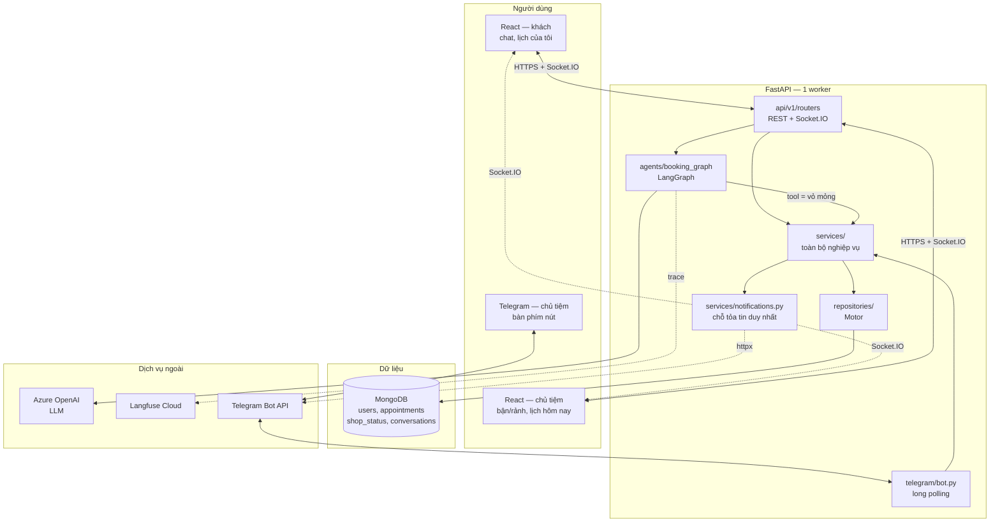
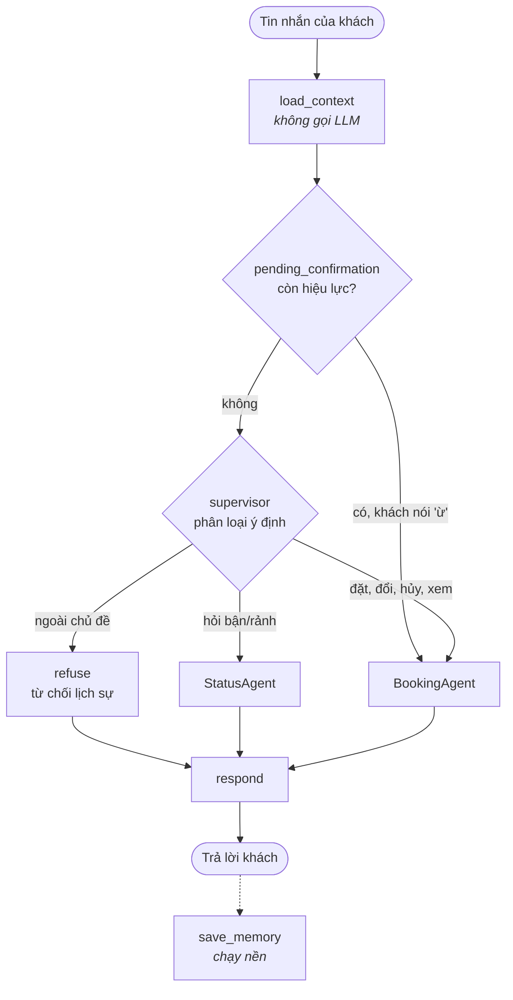
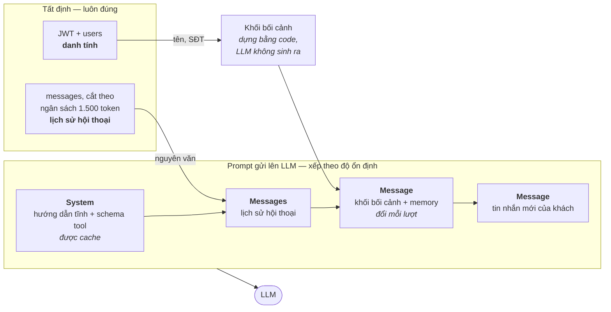
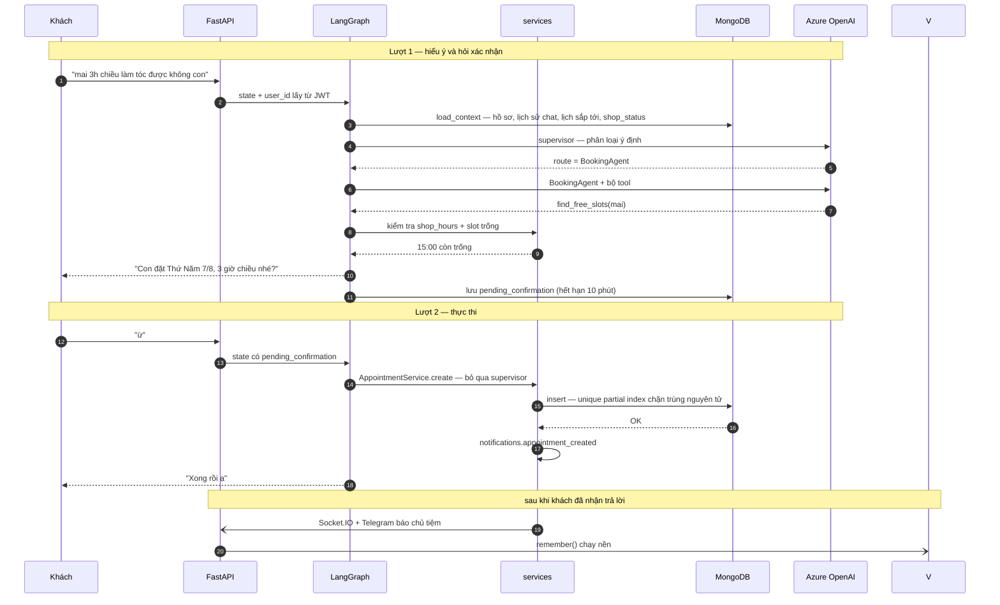

# Kiến trúc

> **Vai xưng hô đã đổi sau tài liệu này.** Từ 2026-08-23 lễ tân xưng "em",
> gọi khách "anh"/"chị". Mọi câu "con", "cô", "chú", "bác" dưới đây là
> nguyên văn của thời điểm đó, giữ lại làm biên bản chứ không phải mẫu để
> chép theo. Vai hiện hành: mục "Xưng hô" trong [`CONTEXT.md`](../../../../CONTEXT.md).

Ngăn xếp, ranh giới các tầng, hạ tầng, và bốn sơ đồ. Xem [README](README.md) để biết mục tiêu và các quyết định đã chốt.

## Ngăn xếp

Giữ FastAPI + MongoDB (Motor) + Socket.IO từ template hiện có. Thay AutoGen bằng LangGraph. Thêm Langfuse để trace. Thêm một [bot Telegram](06-telegram.md) cho chủ tiệm, gọi HTTP API trực tiếp bằng `httpx`.

## Năm tầng

| Tầng | Trách nhiệm | Không được biết |
|---|---|---|
| `api/v1/routers` | HTTP, Socket.IO, xác thực, validate | Nghiệp vụ |
| `services/` | Đặt lịch, chặn trùng, trạng thái tiệm, xác thực | Sự tồn tại của LLM |
| `agents/` | Hội thoại, định tuyến, gọi tool | DB (chỉ đi qua service) |
| `repositories/` | Truy vấn Mongo | HTTP |

Nguyên tắc quan trọng nhất: **tool của agent là vỏ mỏng bọc quanh service, không tự truy vấn DB**. Nhờ vậy logic chặn trùng giờ chỉ tồn tại một chỗ, dùng chung cho cả đường chat lẫn đường API thường, và kiểm thử được mà không cần LLM.

## Hạ tầng

`docker-compose.yml` giữ `mongo` và `mongo-express`. Không có kho dữ liệu nào khác — toàn bộ dữ liệu ứng dụng nằm trong Mongo.

Langfuse mặc định dùng **Langfuse Cloud** (chỉ cần `LANGFUSE_PUBLIC_KEY`, `LANGFUSE_SECRET_KEY`, `LANGFUSE_HOST`) — không thêm container. Nếu về sau cần dữ liệu nằm trong nhà thì self-host, nhưng Langfuse v3 kéo theo ClickHouse, Redis và MinIO nên chỉ làm khi thật sự cần.

Deploy: hai container (API và React static), hoặc build React rồi để FastAPI serve — chọn lúc triển khai, không ảnh hưởng thiết kế.

---

Bốn sơ đồ, theo thứ tự từ ngoài vào trong:

1. [Tổng thể hệ thống](#1-tổng-thể-hệ-thống) — có những khối gì, nói chuyện với ai
2. [Đồ thị LangGraph](#2-đồ-thị-langgraph) — bên trong agent
3. [Ba tầng trí nhớ](#3-ba-tầng-trí-nhớ) — cái gì đến từ đâu
4. [Luồng một lượt đặt lịch](#4-luồng-một-lượt-đặt-lịch) — mọi thứ chạy cùng nhau ra sao

---

## 1. Tổng thể hệ thống

**Sơ đồ này tồn tại để hai bất biến trở nên nhìn thấy được:**

- `agents/` **không có mũi tên nào** chạm tới `repositories/` hay MongoDB. Mọi thứ agent làm đều đi qua `services/`, nên logic chặn trùng giờ chỉ tồn tại một chỗ và kiểm thử được mà không cần LLM. Nếu lúc code xuất hiện mũi tên đó, đấy là dấu hiệu sai thiết kế.
- `notifications.py` là **cửa ra duy nhất** để báo cho chủ tiệm. Socket.IO và Telegram chỉ là hai nhánh của cùng cửa đó — không ai được gọi tắt, nếu không hai kênh sẽ lệch nhau.

**Vì sao một worker.** Vòng lặp long polling của Telegram chạy trong lifespan của FastAPI. Nhiều worker nghĩa là nhiều tiến trình cùng gọi `getUpdates` trên một bot, và Telegram trả 409 Conflict liên tục. Muốn nhiều worker thì phải tách bot ra tiến trình riêng, và lúc đó Socket.IO cũng cần message queue.

---

## 2. Đồ thị LangGraph

**`load_context` nạp bốn thứ song song**, không thứ nào phụ thuộc thứ nào: hồ sơ user, lịch sử chat cắt theo ngân sách 1.500 token, lịch sắp tới, và `shop_status`.

**Nhánh tắt `pending_confirmation`** là chi tiết quan trọng nhất trong sơ đồ này. Khi AI vừa hỏi "3h chiều Thứ Năm đúng không cô?" ở lượt trước, câu "ừ" của khách đi thẳng vào BookingAgent mà **không qua supervisor** — tiết kiệm một lượt LLM và loại bỏ hẳn khả năng AI hỏi xác nhận vòng vo. Cờ hết hạn sau 10 phút, quá đó thì phải hỏi lại vì nhiều khả năng khách đã chuyển sang chuyện khác.

**Giới hạn "AI chỉ để đặt lịch"** nằm ở ba chỗ trong sơ đồ, không chỉ dựa vào prompt: nhánh `refuse` tường minh; mỗi subagent chỉ được cấp đúng bộ tool của nó; và `user_id` bơm vào từ JWT chứ không đọc từ nội dung tin nhắn.

---

## 3. Ba tầng trí nhớ

Ba tầng chống ba loại lỗi khác nhau:

| Tầng | Chống được | Nếu thiếu thì |
|---|---|---|
| Danh tính | Gọi nhầm tên, hỏi lại tên/SĐT | AI hỏi "cô tên gì ạ" với khách quen |
| Lịch sử hội thoại | Lặp trong cùng phiên | AI chào lại từ đầu mỗi lượt |
| Ngữ nghĩa | Mất ngữ cảnh qua nhiều ngày | Hôm sau mở lại như người lạ |

**Tên gọi không bao giờ đến từ tầng ngữ nghĩa.** Vector search là truy hồi xác suất — nó có thể trả về "cô Lan thích đặt buổi sáng" trong khi người đang đăng nhập là cô Hoa. Nên danh tính đi thẳng từ JWT vào khối bối cảnh dựng bằng code, và prompt nói rõ: memory mâu thuẫn với khối bối cảnh thì tin khối bối cảnh.

**Vì sao khối bối cảnh không nằm trong system prompt.** Prompt caching hoạt động theo tiền tố chung dài nhất. Khối bối cảnh đổi mỗi lượt ("còn 30 phút" → "còn 25 phút"), nên đặt nó ở đầu sẽ khiến mọi lượt chat khác nhau ngay từ token đầu tiên và cache không bao giờ trúng. Xếp theo độ ổn định — tĩnh trước, hay đổi sau — giữ được tiền tố cache mà mô hình vẫn đọc bối cảnh ở vị trí gần câu hỏi nhất.

Tương tự, lịch sử hội thoại đi vào **mảng `messages` thật**, không nhồi thành văn bản trong system prompt.

**Mỗi lượt gọi chỉ nhận đúng thứ nó cần.** Supervisor chỉ phân loại ý định nên không nhận memory, không nhận schema tool, không nhận lịch sắp tới — chỉ 4 lượt chat cuối, khoảng 200 token không cache.

---

## 4. Luồng một lượt đặt lịch

Ba thứ khó diễn đạt bằng văn xuôi mà sơ đồ này cho thấy ngay:

- **Chỗ nào chạy song song** — `load_context` gom mọi truy vấn Mongo cùng lúc, nên nạp bối cảnh không cộng thêm độ trễ.
- **Chỗ nào chặn trùng** — không phải ở tầng ứng dụng mà ở đúng lệnh `insert`, do unique partial index. Nguyên tử, không cần transaction, không cần khóa.
- **Chỗ nào nằm sau lúc khách đã nhận trả lời** — thông báo cho chủ tiệm và ghi memory đều chạy nền. Đường đi mà khách cảm nhận chỉ là 2 lượt LLM ở lượt 1, và **0 lượt** ở lượt 2 nhờ nhánh tắt xác nhận.

### Khi có lỗi

Nguyên tắc phân tuyến: thứ gì khách không thể làm gì được thì fail-soft, thứ gì hỏng dữ liệu thì fail-hard.

| Thành phần chết | Hậu quả |
|---|---|
| Langfuse | Nuốt lỗi, không ai biết |
| Telegram | Ghi log; đặt lịch vẫn thành công, chủ tiệm vẫn thấy trên web |
| Azure OpenAI | "Máy đang bận chút xíu", hiện nút gọi điện cho tiệm |
| MongoDB | Fail-hard: 503, màn hình hiện số điện thoại tiệm |
