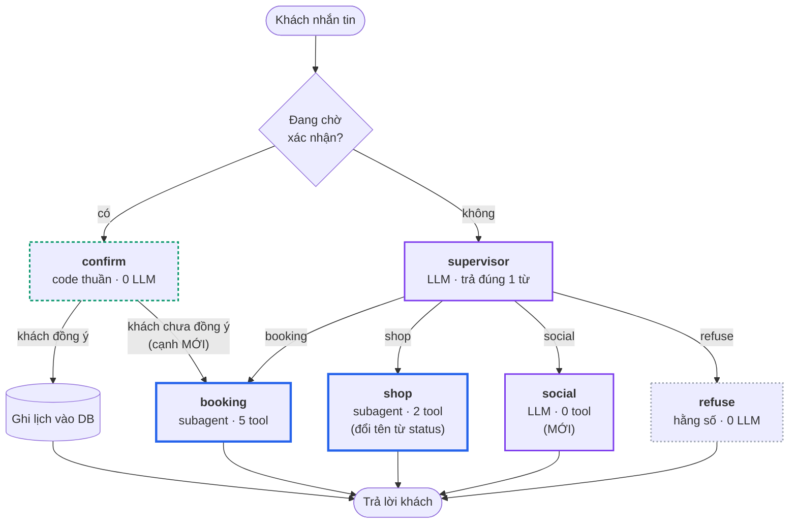
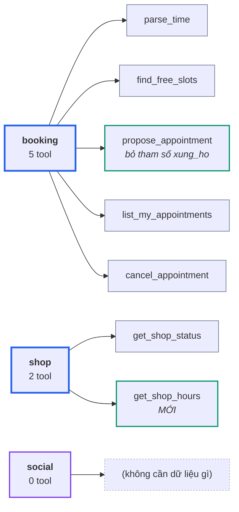
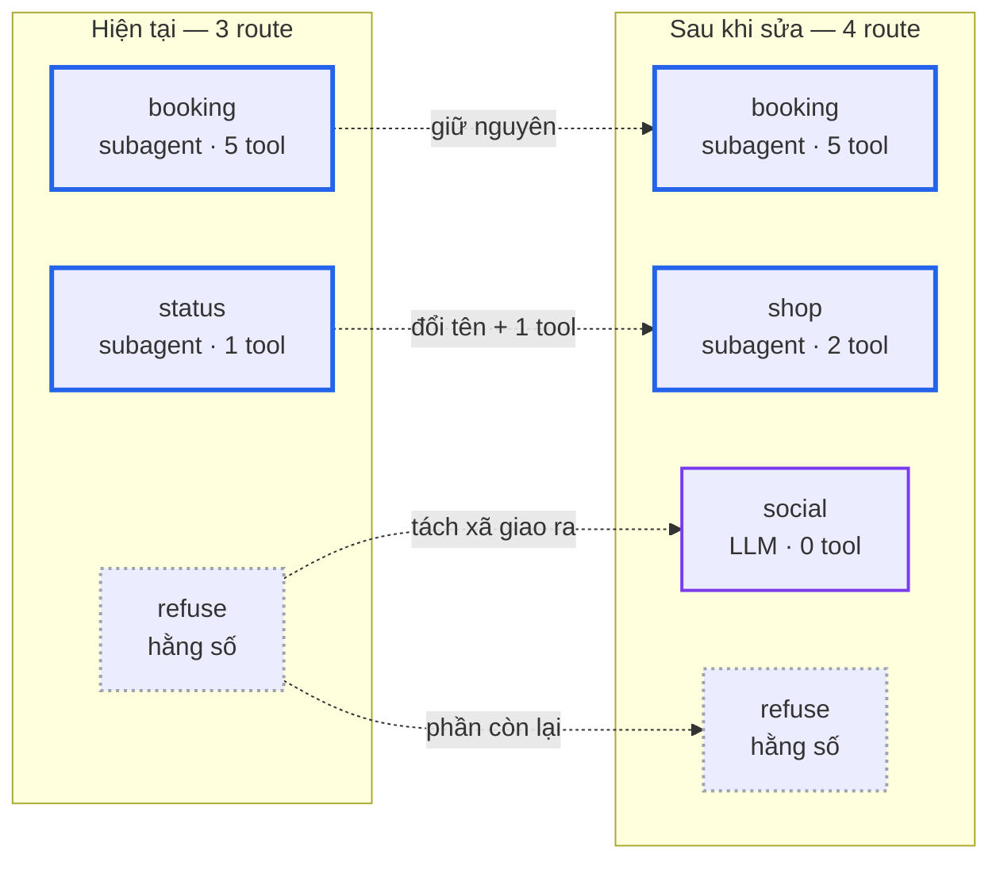

# Thiết kế — Định tuyến lại agent chat và bỏ câu trả lời cứng

Ngày: 2026-08-30

## Vấn đề

Một cuộc trò chuyện đặt lịch chạy thật qua Socket.IO (transcript đầy đủ ở
`chat_transcript.txt`, sinh bằng `scripts/chat_e2e_transcript.py`) cho thấy
câu trả lời của AI bị sượng ở 5 trên 10 lượt. Truy nguồn ra ba nguyên nhân
khác nhau, không phải một.

### 1. Node `refuse` trả hằng số, 0 lượt LLM

`app/agents/booking_graph/supervisor.py:44` trả thẳng `REFUSE_MESSAGE`
(`prompts.py:145`). Mọi câu bị phân loại `refuse` nhận đúng một chuỗi giống
hệt nhau. Lượt 1, 2 và 10 trong transcript trả về y nguyên cùng một dòng.

Chỗ tệ nhất: khách nói **"cảm ơn em nhé"** và bị đáp *"Dạ em chỉ giúp được
việc đặt lịch làm tóc và làm nail thôi ạ."*

### 2. Không có node nào phụ trách thông tin tiệm

Graph hiện có đúng 2 subagent: `booking` (lịch hẹn) và `status` (chủ tiệm
bận hay rảnh). Câu hỏi giờ mở cửa không thuộc về bên nào, nên supervisor đẩy
nó sang `refuse`.

Probe thẳng supervisor cho thấy phân loại còn không ổn định:

```
refuse   <- tiệm mình mở cửa mấy giờ vậy em
status   <- mấy giờ tiệm đóng cửa
```

Cùng một câu hỏi, hai route khác nhau. Nguyên nhân ở `prompts.py:24-33`:
`status` được định nghĩa là *"owner is busy or free, or when the owner
finishes"* — không hề nhắc tới giờ mở cửa. Model không có nhãn đúng để chọn
nên đoán.

Trong khi đó dữ liệu giờ mở cửa **đã có sẵn**: `ShopService.get_hours()`,
model `ShopHours`, và cả màn admin `/chu-tiem/gio-mo-cua` để chủ tiệm sửa.
Khách hỏi một thứ tiệm thật sự có, và bị từ chối.

### 3. `full_name` mang sẵn tiền tố xưng hô mà prompt lại cấm dùng

`context.py:69` nhét nguyên `user.full_name` vào khối bối cảnh. Nhưng
`BOOKING_PROMPT` (dòng cuối) cấm tuyệt đối *"never say cô, chú or bác"*.

Kiểm tra dữ liệu thật:

```
tổng khách trong DB: 13
tên có tiền tố xưng hô: 13   ['Cô Lan', 'Cô Hoa', 'Bác Bảy', 'Chú Hùng', ...]
```

**13/13.** Prompt tự mâu thuẫn với dữ liệu mà chính nó được cho ăn. `User`
model cũng không có trường giới tính, nên model không có căn cứ nào để chọn
đúng "anh" hay "chị" ngoài đoán — và nó đoán khác nhau giữa các lượt.

## Phạm vi

**Trong phạm vi:**

1. Thêm route `shop` (gộp bận/rảnh + giờ mở cửa) và route `social` (chào
   hỏi, cảm ơn).
2. Suy ra xưng hô bằng code từ `full_name`, chốt vào khối bối cảnh.
3. Nhánh "khách không đồng ý" của `confirm` đi tiếp sang `booking` thay vì
   trả một câu cứng.
4. Cắt `BOOKING_PROMPT` bằng cách chuyển rule về docstring của tool.
5. Công cụ kiểm chất lượng: probe phân loại + transcript nhiều kịch bản.

**Ngoài phạm vi (đã cân nhắc và loại):**

- Địa chỉ / SĐT tiệm: DB chưa có chỗ lưu, phải thêm model + màn admin.
- Bảng giá dịch vụ: là một tính năng riêng, không phải sửa định tuyến.
- Thêm trường giới tính vào `User`: đúng bài nhất nhưng đội thêm model,
  migration và UI — quá tay cho lần này. Suy từ tiền tố tên là đủ.

## Kiến trúc sau khi sửa

`VALID_ROUTES` và `SUPERVISOR_PROMPT` lên 4 nhãn:

```
booking : đặt / đổi / hủy lịch, hỏi giờ trống, tra lịch của chính mình
shop    : tiệm bận hay rảnh, khi nào xong, mấy giờ mở/đóng cửa, nghỉ ngày nào
social  : chào hỏi, cảm ơn, tạm biệt
refuse  : còn lại — quảng cáo, kiến thức chung, việc khác
```

Graph 6 node, trong đó **2 subagent có tool**:

| Node | Loại | Tool | Thay đổi |
|---|---|---|---|
| `supervisor` | LLM, trả 1 từ | 0 | prompt: 3 → 4 nhãn |
| `booking` | subagent | 5 | prompt gọn lại, bỏ tham số `xung_ho` |
| `shop` | subagent | **2** | đổi tên từ `status`, thêm `get_shop_hours` |
| `social` | LLM | **0** | **mới** |
| `confirm` | code thuần | — | nhánh không-đồng-ý nối sang `booking` |
| `refuse` | hằng số | — | giữ nguyên |

### Sơ đồ luồng



Viền **xanh dương đậm** = subagent có tool. **Tím** = có LLM nhưng không
tool. **Xanh lá đứt** = code thuần, không LLM. **Xám đứt** = chuỗi cố định.

Chỉ **2 node là subagent thật** (`booking`, `shop`) — đó là những node duy
nhất được dựng qua `make_subagent_node(...)` kèm danh sách tool.

### Tool của từng subagent



**Không có tool nào ghi lịch.** `propose_appointment` chỉ giữ chỗ tạm; lịch
chỉ được ghi ở node `confirm` bằng code, sau khi khách đồng ý ở lượt sau.
Đây là ràng buộc cũ và thiết kế này giữ nguyên.

### So với hiện tại



Số subagent-có-tool **không đổi: vẫn là 2**. Thứ thêm vào là một route và
một node không tool.

### Vì sao không tách `booking` dù nó có 5 tool

Gánh nặng của `booking` nằm ở prompt, không ở số tool:

```
SUPERVISOR_PROMPT   10 dòng,   465 ký tự
STATUS_PROMPT       26 dòng,  1254 ký tự
BOOKING_PROMPT      87 dòng,  4718 ký tự   ← 9 hard rule
```

Prompt gấp 3,8 lần `status`. Và tách ra sẽ đẻ lỗi mới: **"đổi lịch" = hủy +
đặt**. Nếu đẩy `list_my_appointments` + `cancel_appointment` sang agent
riêng, câu *"dời lịch mai sang thứ Năm"* rơi vào một agent thiếu mất một nửa
số tool cần dùng, và supervisor không có cách nào route đúng.

### Vì sao `social` là node riêng, không gộp vào `refuse`

Hai hành vi ngược nhau: xã giao cần ấm và kéo về việc đặt lịch, từ chối cần
dứt khoát. Gộp lại thì prompt phải tự mâu thuẫn.

`refuse` **giữ nguyên hằng số** — nó là hàng rào phạm vi, rẻ và cứng là
đúng. Chỉ những câu ngoài phạm vi thật (quảng cáo, kiến thức chung) mới còn
rơi vào đó.

`social` vẫn dựng bằng `make_subagent_node(SOCIAL_PROMPT, [], tag=RESPOND_TAG)`
với danh sách tool rỗng, để token stream ra màn hình như các node khác. Trả
thẳng chuỗi sẽ rơi lại đúng cái bẫy `refuse` đang mắc.

## Chi tiết từng thay đổi

### A. Node `shop`

Đổi tên `status` → `shop` trên toàn bộ: `graph.py`, `supervisor.py`
(`VALID_ROUTES`), `prompts.py` (`STATUS_PROMPT` → `SHOP_PROMPT`), `tools.py`
(`make_status_tools` → `make_shop_tools`), `tests/test_supervisor.py`.

Không có gì ngoài `app/agents/` phụ thuộc tên này, nên rủi ro thấp — nhưng
phải sửa đồng bộ trong một task.

Tool mới `get_shop_hours`, đọc `ShopService.get_hours()`:

- Trả giờ mở và giờ đóng ở dạng người đọc được, không phải `"08:00"`.
- **`closed_days` theo quy ước 0 = Chủ nhật … 6 = Thứ Bảy**
  (`app/models/shop.py:8`). Đây là chỗ dễ lệch nhất — khác quy ước
  `datetime.weekday()` của Python (0 = Thứ Hai). Phải có test riêng.
- Không có ngày nghỉ thì nói rõ là mở cả tuần.

`SHOP_PROMPT` kế thừa toàn bộ hard rule của `STATUS_PROMPT` (nói mốc giờ
tuyệt đối, không nói đếm ngược, viết giờ theo cách người ta đọc), thêm hướng
dẫn cho `get_shop_hours`.

### B. Node `social`

`SOCIAL_PROMPT` ngắn, không tool. Yêu cầu:

- Phân biệt chào đầu cuộc với cảm ơn / tạm biệt cuối cuộc — hai tình huống
  khác nhau, không dùng chung một câu.
- Một đến hai câu, rồi kéo về việc đặt lịch một cách tự nhiên.
- Kế thừa khối VOICE của các prompt khác (xưng "em", gọi khách theo dòng
  chốt trong khối bối cảnh).
- Tuyệt đối không trả lời câu hỏi ngoài phạm vi — gặp thì lái về đặt lịch.

### C. Xưng hô

Hàm thuần trong `context.py`:

```
derive_address(full_name: Optional[str]) -> tuple[str, str]
```

Trả về `(cách_gọi, tên_hiển_thị)`:

| `full_name` | Kết quả | Khối bối cảnh ghi |
|---|---|---|
| Cô Lan / Chị Lan / Bà Lan | `("chị", "Lan")` | `Gọi khách là: chị Lan` |
| Chú Hùng / Anh Hùng / Ông Hùng | `("anh", "Hùng")` | `Gọi khách là: anh Hùng` |
| Bác Bảy | `("anh chị", "")` | `Gọi khách là: anh chị` |
| Nguyễn Thị Lan (không tiền tố) | `("anh chị", "")` | `Gọi khách là: anh chị` |
| `None` / rỗng | `("anh chị", "")` | `Gọi khách là: anh chị` |

Tiền tố **là tín hiệu giới tính duy nhất đang có** — map nó thay vì vứt đi.
"Bác" mơ hồ về giới nên lùi về `anh chị`, trùng với fallback đã có sẵn ở
`confirm.py:100`.

Khối bối cảnh giữ nguyên dòng `Bạn đang nói chuyện với: …` nhưng dùng tên đã
tách tiền tố, và **thêm một dòng chốt cách gọi**. Model chỉ việc chép.

**Hệ quả kéo theo:** `confirm.py` đang lấy xưng hô từ `pending["xung_ho"]`,
do model điền lúc gọi `propose_appointment`. Có `derive_address` rồi thì
`confirm` tự tính lại từ `user` trong closure. Nên:

- bỏ tham số `xung_ho` khỏi `propose_appointment` (3 tham số → 2)
- xoá hẳn hard rule 6 trong `BOOKING_PROMPT`
- hết cả một lớp lỗi "model quên truyền `xung_ho`"

### D. `confirm` khi khách không đồng ý

Nhánh không-đồng-ý hiện trả một câu duy nhất cho mọi kiểu từ chối
(`confirm.py:103`). Transcript lượt 6: khách nói *"à khoan, để chị xem lại"*
và bị giục *"vậy chị muốn đặt ngày giờ nào ạ?"*.

Đổi thành cạnh graph `confirm → booking`. Lý do: "khoan", "không, 10 giờ đi
em", "đổi sang thứ Năm" — cả ba đều là *vẫn đang đặt lịch*. `booking` đã có
history và đủ tool để xử lý tự nhiên.

**Nhánh đồng ý — nhánh ghi DB — giữ nguyên 0 lượt LLM.** Đây là ràng buộc
bất di bất dịch: node tạo lịch phải tất định. Nhánh không-đồng-ý không chạm
DB nên cho qua LLM là an toàn.

Chi phí: một lượt `booking` cho nhánh này, đúng bằng chi phí nếu khách gõ
thẳng "thôi 10 giờ đi em" ngay từ đầu.

### E. Cắt `BOOKING_PROMPT`

Phát hiện chính khi đọc hết 9 rule: **nhiều rule lặp lại y nguyên nội dung
đã có trong docstring của tool.**

| Rule | Đi đâu |
|---|---|
| 1 — thứ tự gọi tool | → docstring; phần "câu chốt viết thế nào" ở lại |
| 2 — gọi `list_my_appointments` ngay, gọi trước khi hủy | → docstring (đã có sẵn phần lớn) |
| **2b — cấm đụng lịch người khác** | **ở lại nguyên văn** |
| 3, 4 — offer 2 slot gần nhất, cấm bịa slot | → docstring `find_free_slots` |
| 5 — `parse_time` trước, ghép cụm đầy đủ | → docstring `parse_time` (đã có sẵn phần lớn) |
| 6 — `xung_ho` | **xoá** (mục C làm nó thừa) |
| 7, 8, 9 + VOICE | ở lại — không tool nào sở hữu |

Rule 2b **phải ở lại nguyên văn**: nó là rule bảo mật, và nó bảo model
*đừng gọi tool nào cả* — docstring của tool là chỗ sai để nói điều đó.

Ước tính prompt còn khoảng một nửa, **không mất ràng buộc nào** — chủ yếu là
gỡ trùng lặp.

## Cách verify

### Phần tất định — pytest thường, không gọi mạng

Repo đã có sẵn `FakeModel` + monkeypatch (`tests/test_supervisor.py:7`,
`tests/test_subagents.py:39`). Gần như toàn bộ thay đổi lần này là đấu dây,
và đấu dây test được sạch:

| Kiểm | Cách |
|---|---|
| `derive_address()` | bảng 5 ca ở mục C |
| Khối bối cảnh có dòng chốt xưng hô | assert chuỗi |
| Tên khách không còn lọt tiền tố | assert khối bối cảnh không chứa "Cô ", "Chú ", "Bác " |
| 4 route hợp lệ; nhãn lạ vẫn fallback `booking` | `patch_model("shop")`, `patch_model("rác")` |
| `shop` nhận đúng 2 tool | assert danh sách tool |
| `get_shop_hours` format ngày nghỉ | **quy ước 0 = Chủ nhật** — test riêng |
| `confirm` đồng ý → ghi lịch, 0 LLM | test cũ, giữ nguyên |
| `confirm` không đồng ý → sang `booking`, **không** ghi lịch | test mới, quan trọng nhất |
| `propose_appointment` hết tham số `xung_ho` | test cũ sửa theo |

Toàn bộ chạy trong CI, không tốn LLM.

### Phần chất lượng — không test tự động được

Hai thứ chỉ máy thật trả lời được: supervisor phân loại có đúng không, và
câu chữ có tự nhiên không.

**Probe phân loại** (`scripts/probe_supervisor.py`) — mỗi câu 1 lượt LLM, in
bảng. Chạy TRƯỚC khi sửa để có mốc đối chiếu; hiện đang fail:

```
shop     <- tiệm mình mở cửa mấy giờ vậy em
shop     <- mấy giờ tiệm đóng cửa
social   <- chào em
social   <- cảm ơn em nhé
booking  <- chị muốn làm tóc
refuse   <- cho tôi công thức nấu phở
```

**Transcript nhiều kịch bản** — nâng `scripts/chat_e2e_transcript.py` lên 4
kịch bản: đặt lịch cơ bản, đổi ý giữa chừng (đúng ca lượt 6), hủy lịch, hỏi
thông tin tiệm. Chạy trước và sau khi cắt prompt, đọc hai transcript cạnh
nhau.

### Rủi ro đã biết, nói thẳng

Phần chất lượng **không phải test** — nó không assert gì, người phán xét
cuối cùng là mắt người đọc. Với việc cắt `BOOKING_PROMPT`, đó là tất cả
những gì ta có.

Cụ thể: nếu cắt xong mà model bắt đầu quên gọi `parse_time` trước, **không
có gì bắt được tự động** — chỉ lộ ra khi đọc transcript, hoặc khi khách thật
gặp lỗi.

Vì thế: **cắt prompt là task cuối và commit riêng**, để nếu chất lượng tụt
thì revert đúng một commit mà không mất phần định tuyến.

## Thứ tự triển khai

1. Công cụ đo trước (probe + transcript nhiều kịch bản) — để có mốc đối chiếu.
2. `derive_address` + khối bối cảnh + bỏ `xung_ho`.
3. Node `shop` (đổi tên + tool `get_shop_hours`).
4. Node `social` + supervisor 4 nhãn.
5. Cạnh `confirm → booking`.
6. Cắt `BOOKING_PROMPT` — **commit riêng, cuối cùng**.
